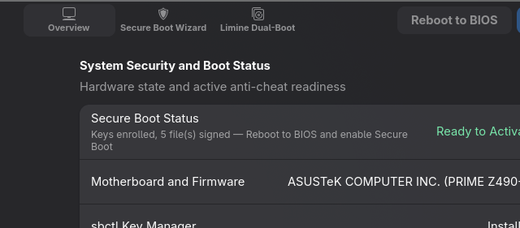
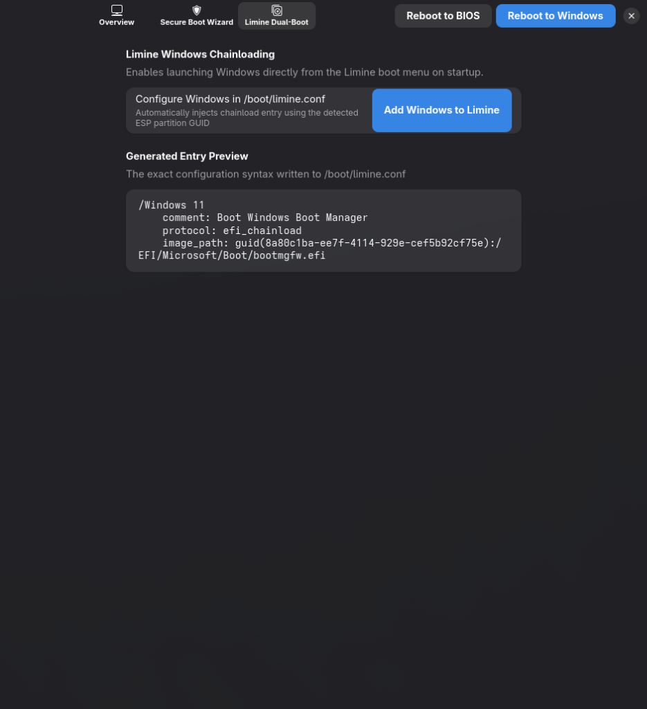
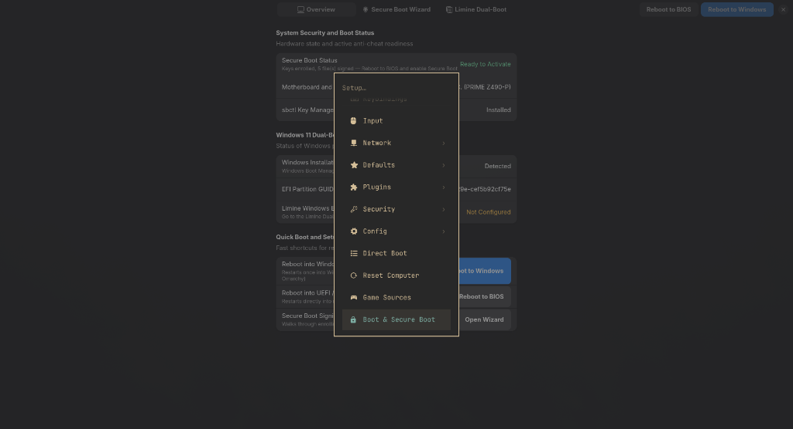

# Omarchy Boot and Secure Boot Manager

An Omarchy plugin that bridges the gap between Windows and Omarchy Linux for users who dual-boot or plan to transition from Windows.

It solves the two biggest pain points in Linux gaming and dual-booting:

1. **Anti-Cheat Compatibility via Permanent Secure Boot**: Enrolls custom Secure Boot keys alongside Microsoft OEM keys so games that require Secure Boot (Valorant/Vanguard, EasyAntiCheat titles, FACEIT) work in Windows while Omarchy boots cleanly with Secure Boot enabled permanently.
2. **Limine Dual-Boot Integration**: Automatically detects Windows EFI System Partitions and injects a chainload entry into Limine with one click.
3. **Quick Reboot Controls**: Reboot directly into Windows (one-shot via `efibootmgr -n`) or into UEFI/BIOS setup (`systemctl reboot --firmware-setup`) without holding keyboard hotkeys during POST.

---

## Screenshots

### Overview Dashboard



### Secure Boot Setup Wizard


### Limine Dual-Boot Configuration



### Omarchy Menu Integration

The plugin adds three entries to the Omarchy menu. Search "boot", "bios", or "windows" in the launcher.



---

## Installation

```bash
git clone https://github.com/Azteriisk/omarchy-boot-manager.git
cd omarchy-boot-manager
chmod +x install.sh
./install.sh
```

The installer:

1. Copies the plugin to `~/.config/omarchy/plugins/azterisk.boot/`.
2. Symlinks `omarchy-boot` and `omarchy-boot-gui` into `~/.local/bin/`.
3. Installs the `.desktop` launcher.
4. Merges three entries into `~/.config/omarchy/extensions/omarchy-menu.jsonc`:
   - **Setup > Boot and Secure Boot** — opens the GUI
   - **System > Reboot into Windows** — one-shot boot to Windows
   - **System > Reboot into BIOS Setup** — direct firmware entry

---

## Secure Boot Setup Runbook

### Why this exists

The UEFI specification makes `SecureBoot` a read-only runtime variable. No software can toggle BIOS Secure Boot on or off from within a running OS. The standard workaround of disabling Secure Boot to run Linux breaks anti-cheat systems that verify `SecureBoot == 1` when Windows boots.

The correct solution is to enroll your own Platform Key (PK) alongside Microsoft's certificates. Your bootloader and kernels are signed with your key. Windows still sees legitimate Microsoft CA certs. Secure Boot stays enabled for both operating systems permanently.

### Step 1: Put BIOS into Setup Mode

Setup Mode clears the existing Platform Key, which allows new keys to be enrolled. The GUI detects your motherboard vendor and shows exact BIOS navigation steps.

General procedure:

1. Reboot into BIOS (F2 or DEL on most boards, or use "Reboot into BIOS Setup" from the Omarchy menu).
2. Navigate to the Secure Boot section (usually under Boot or Security).
3. Find "Key Management" or "Secure Boot Keys" and choose "Clear" or "Delete All Keys".
4. Save and boot back into Omarchy.

### Step 2: Run the Wizard

In the GUI, go to the **Secure Boot Wizard** tab and click **Run Wizard**. This opens a terminal running `omarchy-boot setup`, which:

1. Installs `sbctl` if not present.
2. Generates your custom PK, KEK, and db keys.
3. Enrolls them alongside Microsoft OEM certificates (`sbctl enroll-keys -m`).
4. Discovers and signs all EFI binaries with `sbctl sign -s`:
   - `BOOTX64.EFI` and `LIMINE_X64.EFI` (bootloader)
   - All kernel UKIs in `/boot/EFI/Linux/` (e.g. `omarchy_linux-omarchy.efi`, `omarchy_linux.efi`)
   - `fwupdx64.efi` (firmware updater)
   - All snapshot kernel history EFIs in `limine_history/` directories
5. Runs `sbctl verify` to confirm all registered files are signed.

The `-s` flag on live kernel files registers them with sbctl's pacman hook so they are automatically re-signed on every kernel update.

### Step 3: Enable Secure Boot in BIOS

After the wizard completes, the GUI shows a green "Ready to Activate" badge and a "Reboot to BIOS Now" button. Click it, then:

1. Navigate to Secure Boot settings.
2. Set OS Type to "Windows UEFI Mode" (ASUS) or enable Secure Boot directly.
3. Save and exit.

Omarchy and Windows will both boot with Secure Boot permanently active.

---

## Command Line Interface

```bash
# Full status report
omarchy-boot status

# Status as JSON (for scripts or shell widgets)
omarchy-boot json

# Reboot into Windows on next boot only (returns to Omarchy after)
omarchy-boot reboot windows

# Reboot directly into UEFI/BIOS firmware setup
omarchy-boot reboot bios

# Add detected Windows partition chainload entry to /boot/limine.conf
omarchy-boot add-windows

# Interactive terminal setup wizard
omarchy-boot setup

# Launch the graphical interface
omarchy-boot gui
```

---

## Technical Notes

**ESP mount permissions**: Omarchy mounts the EFI System Partition with `fmask=0077`, making `/boot` unreadable by non-root users. The plugin accounts for this by using `sudo find` for EFI discovery at signing time rather than Python `glob()`, which silently returns empty results for unreadable directories.

**Snapshot kernels**: Limine with `limine-snapper-sync` stores immutable kernel copies for each Btrfs snapshot in a `limine_history/` directory on the ESP. These are not tracked by sbctl's signing database since they never change, but must be individually signed for Secure Boot to permit booting into snapshots. The wizard handles this automatically.

**Microsoft OEM key preservation**: The `-m` flag in `sbctl enroll-keys -m` includes Microsoft's CA and KEK certificates alongside your custom keys. This is required for Windows Boot Manager and Windows anti-cheat systems to continue working. Omitting it results in Windows refusing to boot under Secure Boot.

**Key re-enrollment**: If you reinstall Omarchy or reset your BIOS to factory defaults, you will need to re-run the wizard. Your previous keys are stored in `/var/lib/sbctl/` and can be re-enrolled without regenerating them.

---

## Uninstallation

```bash
cd omarchy-boot-manager
./uninstall.sh
```

This removes the plugin directory, symlinks, desktop launcher, and menu entries.

---

## License

MIT - [Azteriisk](https://github.com/Azteriisk)
